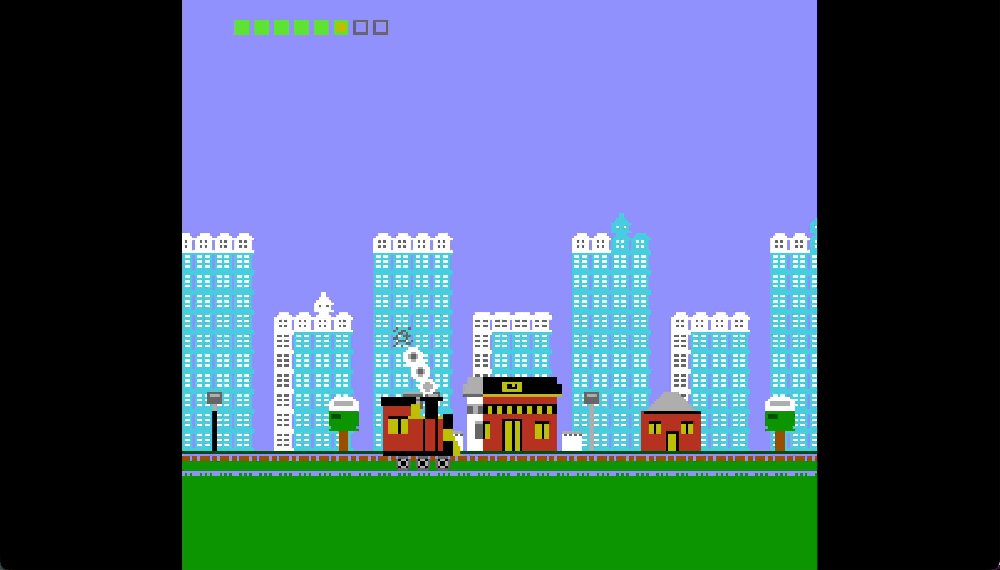

# nanorails 🚂

A self-driving "tiny train sim" — *Tiny Rails, but tinier* — for the **Advanced NES
(ANES)**, the dual-PPU NES hardware mod by [decrazyo](https://github.com/decrazyo/anes).



A cute steam locomotive rides itself through a parallax town, pulling into stations,
picking up and dropping coaches, puffing smoke, and blowing its whistle — all on its
own, forever. No input required; it's a toy that plays itself (controls optional).

## Features

- **Self-driving state machine** — `DWELL -> ACCELERATE -> CRUISE -> BRAKE -> arrive -> DWELL`,
  looping. ~2-minute trips between two alternating depots. Stops are odometer-snapped so
  the train always lines up with a platform.
- **Dual-PPU parallax** — far city skyline (PPU2, back layer) scrolls at half the speed
  of the near town + track (PPU1, front layer). That's the ANES party trick.
- **Coupled coaches** added/removed at stations — and **mass changes the physics**:
  more cars = slower acceleration *and* longer braking. The train is split across
  **both PPUs' sprite layers** to beat the 8-sprites-per-scanline limit.
- **Speed gauge HUD** (sprite-based, doesn't scroll) — green -> yellow -> red express band.
- **Day/night cycle** — the sky backdrop drifts day -> sunset -> night -> dawn.
- **APU SFX** (no music): departure whistle, arrival bell, exhaust chuff that quickens
  with speed, brake hiss.
- Speed-reactive **wheel spin** and **smoke**.

## Controls

Self-drives by default. Optional, layered on top of the autopilot:

- **Right / A** — throttle (express; also departs a station early)
- **Left / B** — brake

## Build & run

Needs [`cc65`](https://cc65.github.io/) and the dual-PPU
[Mesen2 fork](https://github.com/decrazyo/Mesen2) (the only emulator that runs ANES ROMs).

```bash
make            # assembles bin/nanorails.nes
./run.sh        # regenerates art, builds, and launches in the dual-PPU Mesen
```

## How it's built

- `tools/gen.py` generates **all** the pixel art procedurally -> the 4 KB CHR
  (`binclude/background.chr`, 256 tiles shared by both PPUs and sprites), the palettes
  (`src/palette.s`), the two scrolling nametables (`src/leveldata.s`), the locomotive
  metasprite (`src/traindata.s`), and tile-id constants (`include/gen.inc`).
- `src/train.s` is the whole sim: state machine, fixed-point physics, metasprite
  assembly, day/night, and SFX triggers.
- `src/sfx.s` drives the APU. `src/nmi.s` carries a small day/night backdrop write.
- The rest is the lean ANES engine, where PPU1 = `$2000-$2007` and PPU2 = `$3000-$3007`.

## The interesting constraint

The NES shows only **8 sprites per scanline**. A wide locomotive eats that budget and
evicts the coaches, so the loco is a tiny 4-tile engine and the train is split across
**both PPUs' independent sprite evaluators** to roughly double the per-scanline budget.
The catch: PPU2 is the *back* layer, so coaches on it duck behind the near-town
foreground (a depth effect, but a fully-clean long train trades against the parallax).

A browser demo lives in [`web/`](web/).

Built with Claude Code.
